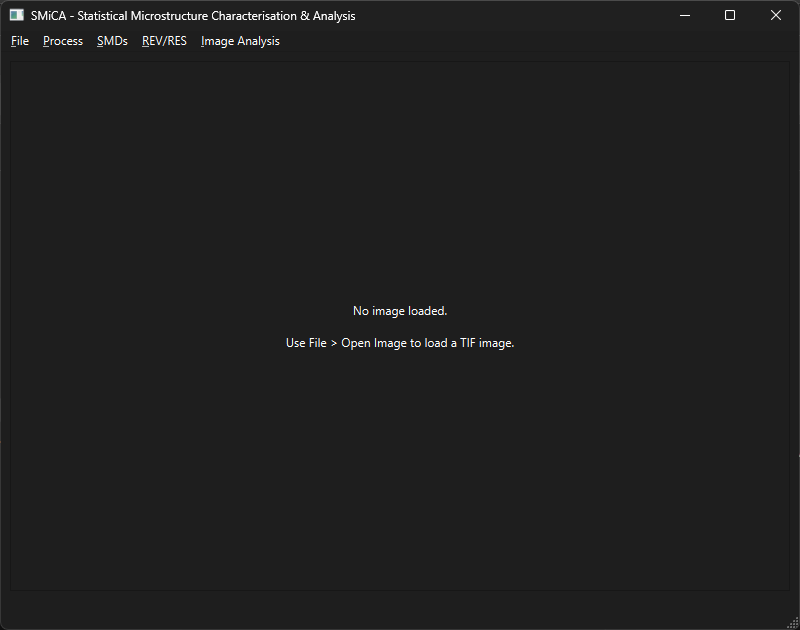
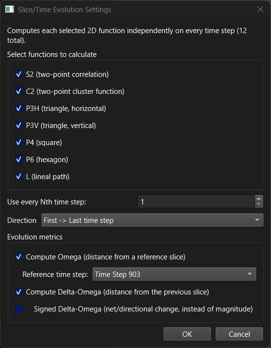
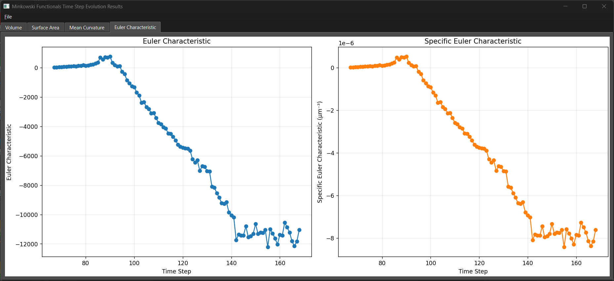
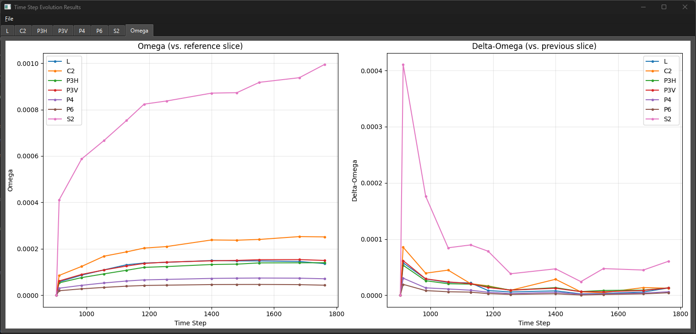

# SMiCA: Statistical Microstructure Characterisation & Analysis

A GUI application for analyzing microstructure images using correlation functions, Minkowski functionals, and other statistical/morphological descriptors, specifically designed for materials science and microstructure characterization.


## Features

### Image Loading & Large-Dataset Support

- **Single 2D/3D images**: open a binary TIF/TIFF file directly (multi-page TIFF = 3D volume).
- **3D volume from Z-slice folder**: assemble one 3D volume from a folder of 2D slice files.
- **Time series / 4D datasets from a folder**: each time step can be a single 2D slice or a full 3D volume, sorted by a number extracted from the filenames (with a range/select picker).
- **Low-memory streaming mode**: for datasets with many large 3D volumes (e.g. dozens of XCT volumes) that don't fit in RAM as one 4D array, only the file paths are kept and volumes are loaded, processed, and discarded one at a time - peak memory stays at "one volume's worth" regardless of how many time steps there are.
- **Interactive viewer**: slice/time sliders for 3D and 4D data, real-time pixel value on hover, coordinate tracking.

### Statistical Microstructure Descriptors (SMDs)

- Two-point correlation function (S2) and its scaled form (F2), in 2D and 3D.
- Two-point cluster function (C2), in 2D and 3D.
- Additional 2D polytope functions: P3H, P3V (triangles), P4 (square), P6 (hexagon).
- Lineal-path function (L), in 2D and 3D.
- **Evolution across a stack**: compute any of the above independently on every slice/time-step of a 3D or 4D dataset, with Omega and Delta-Omega evolution metrics relative to a reference slice.
- JIT-compiled with Numba for performance.

### Chord Length

- Mean chord length via the S2 slope (r=0) and via direct run-length sampling, plus the chord-length distribution, for a single 2D/3D image.
- Evolution across a 3D/4D stack, with an interactive slice picker for comparing chord-length distributions.

### Representative Elementary Volume/Size (REV/RES)

- REV (3D) / RES (2D) analysis using S2 and F2 across randomly sampled sub-volumes, following [Amiri et al., 2024](https://doi.org/10.1029/2024JH000178).

### Minkowski Functionals

- 2D: area, perimeter, Euler characteristic (plus area fraction, specific perimeter, specific Euler characteristic).
- 3D: volume, surface area, mean curvature, Euler characteristic (plus porosity, specific surface area, specific mean curvature, specific Euler characteristic).
- Computed via [QuantImPy](https://github.com/boeleman/quantimpy), with the library's internal Mecke-normalization constants corrected back out so the reported values are the true physical/topological quantities (matching the classical integral-geometry definitions), not QuantImPy's raw normalized output.
- Single-image results in a table with CSV export, or evolution across a 2D/3D time series or 4D dataset (same low-memory streaming support as above).


### Data Export & Visualization

- Matplotlib-based plotting for every result type, with tabs for multi-function/multi-tab results.
- Save plots as PNG, JPEG, or PDF; export underlying data as CSV.


## Installation

### Prerequisites

- Python 3.8 or higher
- Conda (Anaconda or Miniconda) recommended

### Option 1: Using Conda (Recommended)

```bash
# Clone the repository
git clone https://github.com/hamediut/SMiCA.git
cd SMiCA

# Create and activate conda environment
conda create -n gui_micro python=3.10
conda activate gui_micro

# Install dependencies
pip install -r requirements.txt

# Install the package in development mode
pip install -e .
```

### Option 2: Using pip with virtual environment

```bash
# Clone the repository
git clone https://github.com/hamediut/SMiCA.git
cd SMiCA

# Create virtual environment
python -m venv venv

# Activate virtual environment
# On Windows:
venv\Scripts\activate
# On Linux/Mac:
source venv/bin/activate

# Install dependencies
pip install -r requirements.txt

# Install the package
pip install -e .
```

> **Note on licensing**: this project is MIT-licensed, but the Minkowski functionals feature depends on [QuantImPy](https://github.com/boeleman/quantimpy), which is GPLv3+. It's used as an ordinary installed dependency (not vendored source), which keeps this project's own code MIT while still being able to use it - see `requirements.txt` for details and the citation to use if you publish results computed with it.

## Usage

### Running the Application

#### Method 1: Run as an installed package (for using the app)

```bash
micro-gui
```

This only works after `pip install -e .` has been run once (see Installation above) - that step registers `micro-gui` as a command in your environment (on Windows it creates `micro-gui.exe` in the environment's `Scripts` folder; on Linux/Mac a `micro-gui` script in `bin`). Once installed, as long as the environment is activated, typing `micro-gui` launches the app **from any directory** - you don't need to be inside the cloned repo, and you don't need to know anything about how the source code is organized. This is the way to run the app day-to-day once it's installed, e.g. for a user who just wants to use it rather than edit its code.

#### Method 2: Run the entry-point script directly (for development)

```bash
python ImageViewer.py
```

This is what you'd use while actively editing the source in an editor like VS Code - it does **not** require `pip install -e .` at all, only the dependencies from `requirements.txt`. It works because `ImageViewer.py` sits at the repo root and imports `src.micro_gui` directly, so it only needs to be run from the repo root with the dependencies installed. Any change you make to the source under `src/micro_gui/` takes effect the next time you run this command - nothing needs to be reinstalled.

### Basic Workflow

1. **Load data** (`File` menu):
   - `Open Single 2D/3D Image` (`Ctrl+O`) - one binary TIF/TIFF file.
   - `Import Single 3D Volume (from Z-Slice Files)` - assemble one volume from a folder of 2D slices.
   - `Import Time Series/4D Dataset (2D or 3D per step)` - a folder of multiple time steps; check "Low-memory mode" if you have many large 3D volumes that won't fit in RAM at once.
   - For 3D/4D data, use the slice/time sliders to navigate.

   

2. **Binarize if needed** (`Process > Binarize`): pick which pixel value is the foreground; everything else becomes background.

3. **Run an analysis**:
   - `SMDs > Calculate SMDs` (or `Calculate Slice Evolution` for a stack) - select which functions to compute.

     

   - `SMDs > Calculate Chord Length` (or `Calculate Chord Length Evolution`).
   - `REV/RES > Calculate REV/RES` (`Ctrl+R`).
   - `Image Analysis > Calculate Minkowski Functionals` - single image or evolution, automatically detected from what's loaded.

     

   Example evolution result (Omega/Delta-Omega across a time series):

   

4. **Export Results**: every plot window has `File > Save Plot as Image` and `File > Export Data as CSV`; the Minkowski results table has its own `Save to CSV` button.


## Project Structure

```
SMiCA/
├── src/
│   └── micro_gui/           # Main package
│       ├── main.py          # Entry point
│       ├── gui/             # Main window, menus, and one settings-dialog/plot-window pair per analysis
│       ├── analysis/        # Analysis algorithms, no Qt dependency (SMDs, chord length, REV/RES, Minkowski functionals)
│       └── utils/           # Image loading/info utilities
├── tests/                   # Unit tests
├── notebooks/               # Validation/comparison notebooks
├── cpp_poly/                # Reference C++ implementation used to validate the Python/Numba polytope functions
├── ImageViewer.py           # Entry-point script
├── requirements.txt
├── setup.py
├── LICENSE                  # MIT License
└── README.md
```


## Citation

If you use this software in your research, please cite:

```bibtex
@software{smica_2025,
  title = {SMiCA: Statistical Microstructure Characterisation & Analysis},
  author = {Hamed Amiri},
  year = {2025},
  url = {https://github.com/hamediut/SMiCA}
}
```

If you use the Minkowski functionals feature, please also cite QuantImPy:

```bibtex
@article{boelens2021quantimpy,
  title = {QuantImPy: Minkowski functionals and functions with Python},
  author = {Boelens, Arnout M.P. and Tchelepi, Hamdi A.},
  journal = {SoftwareX},
  volume = {16},
  pages = {100823},
  year = {2021},
  doi = {10.1016/j.softx.2021.100823}
}
```

## License

This project is licensed under the MIT License - see the LICENSE file for details. Note that the optional Minkowski functionals feature depends on QuantImPy, which is GPLv3+ (see "Note on licensing" under Installation).

## Acknowledgments

- Built with [PySide6](https://wiki.qt.io/Qt_for_Python) for the GUI
- Uses [Numba](https://numba.pydata.org/) for performance optimization
- Minkowski functionals computed with [QuantImPy](https://github.com/boeleman/quantimpy)
- Visualization powered by [Matplotlib](https://matplotlib.org/)


## Version History

- **v0.2.0** (2026-07) - Major feature expansion
  - Minkowski functionals (2D/3D, single image and evolution across a stack/4D dataset)
  - Chord length calculation (single image and evolution)
  - Low-memory streaming mode for large 4D datasets (many large 3D volumes)
  - Progress bars with time estimates for evolution-style calculations
  - Reorganized menus (`Image Analysis` menu added)
- **v0.1.0** (2025-01-17) - Initial alpha release
  - Basic 2D/3D image loading
  - SMDs calculation
  - REV/RES analysis
  - Plot visualization and export

---

**Note**: This is an alpha version under active development. APIs and features may change.
